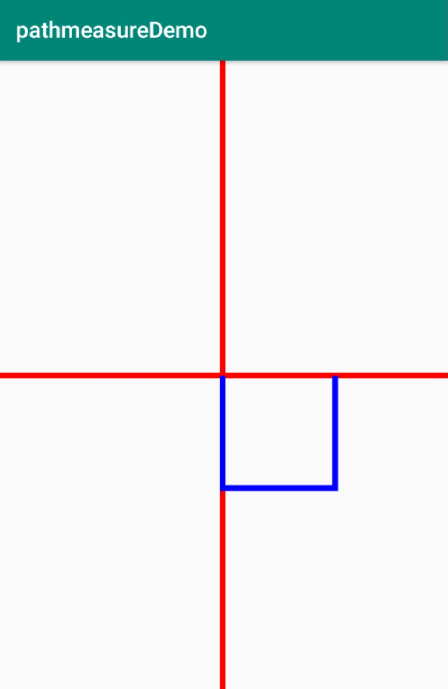
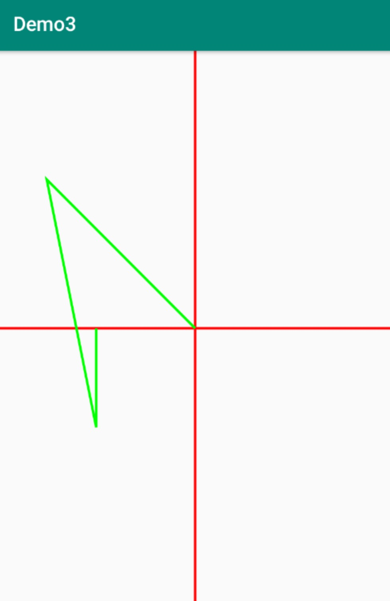

> 顾名思义，对path进行测量的一个工具类
> 作用：测量并获取Path的信息，用于绘制Path路径实现动画效果


### 构造函数

| 方法名 | 释义 |
| --- | --- |
| PathMeasure() | 创建一个空的PathMeasure |
|  PathMeasure(Path path, boolean forceClosed) | 创建 PathMeasure 并关联一个指定的Path(Path需要已经创建完成)。 |

### 公共方法

| 返回值 | 方法名 | 释义 |
| --- | --- | --- |
| void | setPath(Path path, boolean forceClosed) | 关联一个path |
| boolean | isClosed() | 是否闭合 |
| float | 	getLength() | 获取Path的长度 |
| boolean | 	nextContour() | 跳转到下一个轮廓 |
| boolean | getSegment(float startD, float stopD, Path dst, boolean startWithMoveTo) | 截取片段 |
| boolean | getPosTan(float distance, float[] pos, float[] tan) | 获取指定长度的位置坐标及该点切线值  |
|boolean | getMatrix(float distance, Matrix matrix, int flags) | 获取指定长度的位置坐标及该点Matrix |


#### 1.构造函数
```kotlin
paint.color = Color.RED
            canvas.drawLine(width / 2f, 0f, width / 2f, height * 1f, paint)
            canvas.drawLine(0f, height / 2f, width * 1f, height / 2f, paint)
            canvas.translate(width / 2f, height / 2f)
            path.lineTo(0f, 200f)
            path.lineTo(200f, 200f)
            path.lineTo(200f, 0f)

            Log.e(TAG, "forceClosed=false---->" + measure1.length)
            Log.e(TAG, "forceClosed=true----->" + measure2.length)
            paint.color = Color.BLUE
            canvas.drawPath(path, paint) 
```
> 效果 



> 结果如下


#### 在这里有两点需要明确:
> + 不论 forceClosed 设置为何种状态(true 或者 false)， 都不会影响原有Path的状态，即 Path 与 PathMeasure 关联之后，之前的的 Path 不会有任何改变。
> + forceClosed 的设置状态可能会影响测量结果，如果 Path 未闭合但在与 PathMeasure 关联的时候设置 forceClosed 为 true 时，测量结果可能会比 Path 实际长度稍长一点，获取到到是该 Path 闭合时的状态。


#### 2.getSegment
> getSegment 用于获取Path的一个片段，方法如下：
> boolean getSegment (float startD, float stopD, Path dst, boolean startWithMoveTo)

| 参数 | 作用 | 备注 |
| --- | --- | --- |
| startD | 开始截取位置距离 Path 起点的长度 | 取值范围: 0 <= startD < stopD <= Path总长度  |
| stopD | 结束截取位置距离 Path 起点的长度 | 取值范围: 0 <= startD < stopD <= Path总长度 |
| dst | 截取的 Path 将会添加到 dst 中 | 注意: 是添加，而不是替换 |
| startWithMoveTo | 起始点是否使用 moveTo | 用于保证截取的 Path 第一个点位置不变 |

我们创建了一个 Path， 并在其中添加了一个蓝色矩形，现在我们想截取矩形中的一部分，就是下图中绿色的部分。


代码
```kotlin
paint.color = Color.RED
            canvas.drawLine(width / 2f, 0f, width / 2f, height * 1f, paint)
            canvas.drawLine(0f, height / 2f, width * 1f, height / 2f, paint)
            canvas.translate(width / 2f, height / 2f)

            paint.color = Color.BLUE
            path.addRect(-200f, -200f, 200f, 200f, Path.Direction.CW) //顺时针，起始点在左上角
            canvas.drawPath(path, paint)

            pathMeasure.setPath(path, false) //关联path
            //截取200--600的片段,并使用 moveTo 保持截取得到的 Path 第一个点的位置不变
            pathMeasure.getSegment(1000f, 1400f, dst, true)
            paint.color = Color.GREEN
            canvas.drawPath(dst, paint)
```

如果dst有内容会怎样？getSegment最后一个传false如何？
```kotlin
paint.color = Color.RED
            canvas.drawLine(width / 2f, 0f, width / 2f, height * 1f, paint)
            canvas.drawLine(0f, height / 2f, width * 1f, height / 2f, paint)
            canvas.translate(width / 2f, height / 2f)

            paint.color = Color.BLUE
            path.addRect(-200f, -200f, 200f, 200f, Path.Direction.CW) //顺时针，起始点在左上角

            pathMeasure.setPath(path, false) //关联path
            //截取200--600的片段,并使用 moveTo 保持截取得到的 Path 第一个点的位置不变
            dst.lineTo(-300f, -300f)
            pathMeasure.getSegment(1000f, 1400f, dst, false)
            paint.color = Color.GREEN
            canvas.drawPath(dst, paint)
```



> 从上面的示例可以看到 dst 中的线段保留了下来，可以得到结论：
> + **被截取的 Path 片段会添加到 dst 中，而不是替换 dst 中到内容。**
> + **如果 startWithMoveTo 为 true, 则被截取出来到Path片段保持原状，如果 startWithMoveTo 为 false，则会将截取出来的 Path 片段的起始点移动到 dst 的最后一个点，以保证 dst 的连续性。**

从而我们可以用以下规则来判断 startWithMoveTo 的取值：
	
| 取值 | 主要功用 |
| --- | --- |
| true | 保证截取得到的 Path 片段不会发生形变 |
| false | 保证存储截取片段的 Path(dst) 的连续性 |

#### 3.nextContour
> 我们知道 Path 可以由多条曲线构成，但不论是 getLength , getSegment 或者是其它方法，都只会在其中第一条线段上运行，而这个 nextContour 就是用于跳转到下一条曲线到方法，如果跳转成功，则返回 true， 如果跳转失败，则返回 false。

如下，我们创建了一个 Path 并使其中包含了两个闭合的曲线，内部的边长是200，外面的边长是400，现在我们使用 PathMeasure 分别测量两条曲线的总长度。


代码：
```kotlin
paint.color = Color.GRAY
            canvas.drawLine(width / 2f, 0f, width / 2f, height * 1f, paint)
            canvas.drawLine(0f, height / 2f, width * 1f, height / 2f, paint)
            canvas.translate(width / 2f, height / 2f)

            paint.color = Color.BLACK
            paint.strokeWidth = 5f
            path.addRect(-100f, -100f, 100f, 100f, Path.Direction.CW)
            path.addRect(-200f, -200f, 200f, 200f, Path.Direction.CCW)
            canvas.drawPath(path, paint)

            pathMeasure.setPath(path, true) //关联path
            Log.d(TAG, "length1=${pathMeasure.length}")
            pathMeasure.nextContour()
            Log.d(TAG, "length2=${pathMeasure.length}")
```
**log输出结果：**


> 通过测试，我们可以得到以下内容
- 1.曲线的顺序与 Path 中添加的顺序有关。
- 2.getLength 获取到到是当前一条曲线分长度，而不是整个 Path 的长度。
- 3.getLength 等方法是针对当前的曲线(其它方法请自行验证)。

#### 4.getPosTan
> 这个方法是用于得到路径上某一长度的位置以及该位置的正切值

| 参数 | 作用 |	备注 |
| --- | --- | --- |
| 返回值(boolean) |	判断获取是否成功 |	true表示成功，数据会存入 pos 和 tan 中，false  表示失败，pos 和 tan 不会改变 |
| distance | 距离 Path 起点的长度 |	取值范围: 0 <= distance <= getLength |
| pos |	该点的坐标值	| 当前点在画布上的位置，有两个数值，分别为x，y坐标。|
| tan	| 该点的正切值 | 当前点在曲线上的方向，使用 Math.atan2(tan[1], tan[0]) 获取到正切角的弧度值。|

看效果图


关键代码如下：
```kotlin
paint.color = Color.BLACK
            path.addCircle(0f, 0f, 200f, Path.Direction.CW)
            canvas.drawPath(path, paint)
            pathMeasure.setPath(path, false) //关联path

            // 获取当前位置的坐标以及趋势
            pathMeasure.getPosTan(pathMeasure.length * currentStep, pos, tan)
            mMatrix.reset()

            val degrees = (Math.atan2(tan[1].toDouble(), tan[0].toDouble()) * 180.0 / Math.PI).toFloat() // 计算图片旋转角度

            mMatrix.postRotate(degrees, mBitmap!!.width / 2f, mBitmap!!.height / 2f)   // 旋转图片
            mMatrix.postTranslate(
                pos[0] - mBitmap!!.width / 2,
                pos[1] - mBitmap!!.height / 2
            )   // 将图片绘制中心调整到与当前点重合

            canvas.drawBitmap(mBitmap!!, mMatrix, paint)
```
**核心要点:**
> + 1.通过 tan 得值计算出图片旋转的角度，tan 是 tangent 的缩写，即中学中常见的正切， 其中tan[0]是邻边边长，tan[1]是对边边长，而Math中 atan2 方法是根据正切是数值计算出该角度的大小,得到的单位是弧度(取值范围是 -pi 到 pi)，所以上面又将弧度转为了角度。
> + 2.通过 Matrix 来设置图片对旋转角度和位移，这里使用的方法与前面讲解过对 canvas操作 有些类似，对于 Matrix 会在后面专一进行讲解，敬请期待。
> + 3.页面刷新使用ValueAnimator 来控制界面的刷新，关于控制页面刷新这一部分会在后续的 动画部分 详细讲解，同样敬请期待。
#### 5.getMatrix
 这个方法是用于得到路径上某一长度的位置以及该位置的正切值的矩阵：
> boolean getMatrix (float distance, Matrix matrix, int flags)

| 参数 |	作用	| 备注 |
| --- | --- | --- |
| 返回值(boolean) |	判断获取是否成功 |	true表示成功，数据会存入matrix中，false 失败，matrix内容不会改变 |
| distance	|距离 Path 起点的长度 |	取值范围: 0 <= distance <= getLength |
| matrix	| 根据 falgs 封装好的matrix |	会根据 flags 的设置而存入不同的内容
| flags |	规定哪些内容会存入到matrix中	| 可选择POSITION_MATRIX_FLAG(位置) ANGENT_MATRIX_FLAG(正切) |

其实这个方法就相当于我们在前一个例子中封装 matrix 的过程由 getMatrix 替我们做了，我们可以直接得到一个封装好到 matrix，岂不快哉。

**我们可以将上面都例子中 getPosTan 替换为 getMatrix， 看看是不是会显得简单很多:**
```kotlin
paint.color = Color.BLACK
            path.addCircle(0f, 0f, 200f, Path.Direction.CW)
            canvas.drawPath(path, paint)
            pathMeasure.setPath(path, false) //关联path

            // 获取当前位置的矩阵
            pathMeasure.getMatrix(
                pathMeasure.length * currentStep, mMatrix,
                PathMeasure.TANGENT_MATRIX_FLAG or PathMeasure.POSITION_MATRIX_FLAG
            )
            mMatrix.preTranslate(
                -mBitmap!!.width / 2f,
                -mBitmap!!.height / 2f
            )   // 将图片绘制中心调整到与当前点重合

            canvas.drawBitmap(mBitmap!!, mMatrix, paint)
```

**实际效果和getTan一样。**


